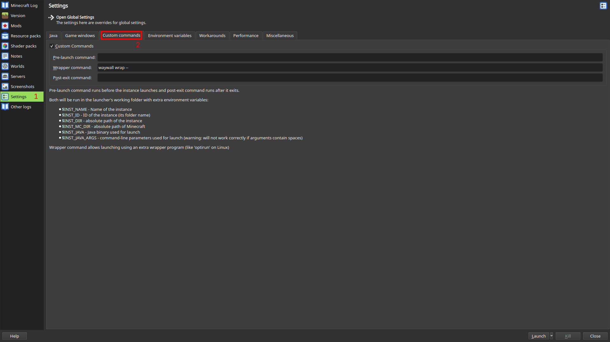
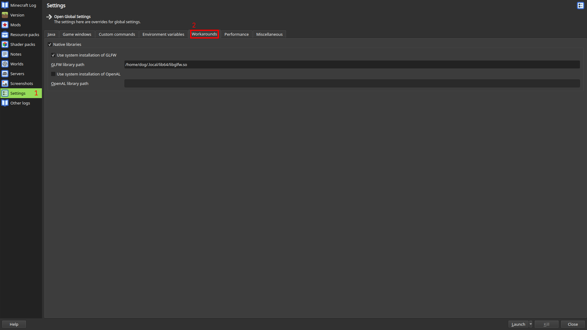
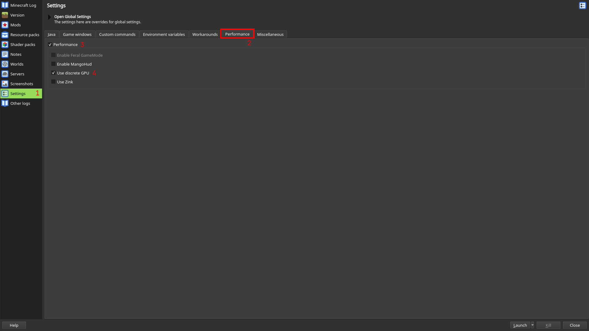

# Setup

After compiling waywall, you will need to configure your instance(s) to use it.
It is *highly recommended* that you use [Prism Launcher]. If you already have
it, [MultiMC] can work, but it lacks some features.

> [!CAUTION]
> If your Minecraft launcher of choice is installed in some sort of container
> (e.g. [Flatpak]), then waywall will not work.
>
> Consider installing [Prism Launcher] from your distribution's package manager
> (if available) or from the [Downloads page](https://prismlauncher.org/download/).

## GLFW

Minecraft uses a library known as [GLFW] in order to create a window and
receive keyboard and mouse input. Unfortunately, the version shipped by default
does not work with waywall, so you will need to compile a patched version of
GLFW.

> [!TIP]
> If you used a [prebuilt package] or built your own with the package building
> script, then you already have the correct version of GLFW available! It can be
> found at `/usr/local/lib64/waywall-glfw/libglfw.so`.

> [!TIP]
> If you are using Prism Launcher installed from Nixpkgs, you can skip and 
> continue to the next step as it already includes the patch.
> 
> If you have Nix but are using Prism Launcher from a *different* source, you can
> install the `glfw3-minecraft` package with `nix profile` and use the path
> `/home/USER/.nix-profile/lib/libglfw.so` in the upcoming steps.

You can compile the patched version of GLFW with the following commands:

```sh
# clone GLFW
git clone https://github.com/glfw/glfw
cd glfw
git checkout 3.4

# apply the patches
curl -o glfw.patch https://raw.githubusercontent.com/tesselslate/waywall/be3e018bb5f7c25610da73cc320233a26dfce948/contrib/glfw.patch
git apply glfw.patch

# compile GLFW
cmake -S . -B build -DBUILD_SHARED_LIBS=ON -DGLFW_BUILD_WAYLAND=ON
cd build
make
```

After running these commands, the new patched version of GLFW will be located at
`glfw/build/src/libglfw.so` (or `src/libglfw.so` from the `build` directory.)
You can copy it to a safer location like `~/.local/lib64`.

> [!IMPORTANT]
> If you move the GLFW library to another location, make sure to copy the
> symlinks (`libglfw.so.3` and `libglfw.so.3.4`) as well.

## Instance setup

First, you need to configure your instance to use waywall. Navigate to the
`Custom commands` submenu and enter `waywall wrap --` into the `Wrapper command`
textbox. If needed, change `waywall` to point to the waywall executable you
compiled earlier.



Secondly, you will need to use the patched version of GLFW. This differs based
on whether you are on PrismLauncher or MultiMC.

### Prism Launcher

You can configure your instance to use the patched version of GLFW by opening
its settings (with the `Edit` button on the right pane) and going to `Settings`
-> `Workarounds`. Then, enable `Native libraries` and `Use system installation
of GLFW`. Finally, enter the path to the patched `libglfw.so` you just compiled
or installed.

> [!IMPORTANT]
> Prism Launcher **will not expand** `~`. If your patched GLFW is within your
> home directory, you need to type out the absolute path.

> [!TIP]
> If you are using Prism Launcher installed from Nixpkgs, you must leave the path
> field empty to automatically use the patched GLFW.



### MultiMC

You can configure your instance to use the patched version of GLFW by opening
its settings (with the `Edit` button on the right pane) and going to `Settings`.
Then, go to the `Workarounds` tab and confirm that `Use system installation of
GLFW` is **disabled**. Finally, return to the `Java` tab and add
`-Dorg.lwjgl.glfw.libname=PATH` to your Java arguments, replacing `PATH` with
the path to the patched `libglfw.so` you just compiled.

> [!IMPORTANT]
> MultiMC **will not expand** `~`. If your patched GLFW is within your home
> directory, you need to type out the absolute path.

## Configuration

waywall follows the [XDG Base Directory] specification and will search for a
configuration file in `$XDG_CONFIG_HOME/waywall` (usually `~/.config/waywall`).
If no configuration file exists, one will be automatically generated for you.
You can use the following configuration as a starting point:

```lua
local waywall = require("waywall")
local helpers = require("waywall.helpers")

local config = {
    input = {
        layout = "us",
        repeat_rate = 40,
        repeat_delay = 300,

        sensitivity = 1.0,
        confine_pointer = false,
    },
    theme = {
        background = "#303030ff",
    },
}

config.actions = {}

return config
```

## NVIDIA

If you use an NVIDIA GPU, you will also need to set the environment variable
`__GL_THREADED_OPTIMIZATIONS` to `0`. This can be done in the `Environment
variables` submenu.

This environment variable fixes a startup crash (`GLFW error 65544`) and also
ensures that preemptive navigation works correctly.

### Dual-GPU systems

If you have a system with an Nvidia GPU and an integrated GPU (quite common
in laptops), go to the `Performance` tab and check `Use discrete GPU`.



[Flatpak]: https://flatpak.org
[prebuilt package]: https://github.com/tesselslate/waywall/releases
[Prism Launcher]: https://prismlauncher.org
[MultiMC]: https://multimc.org
[GLFW]: https://github.com/glfw/glfw
[XDG Base Directory]: https://specifications.freedesktop.org/basedir/latest/
