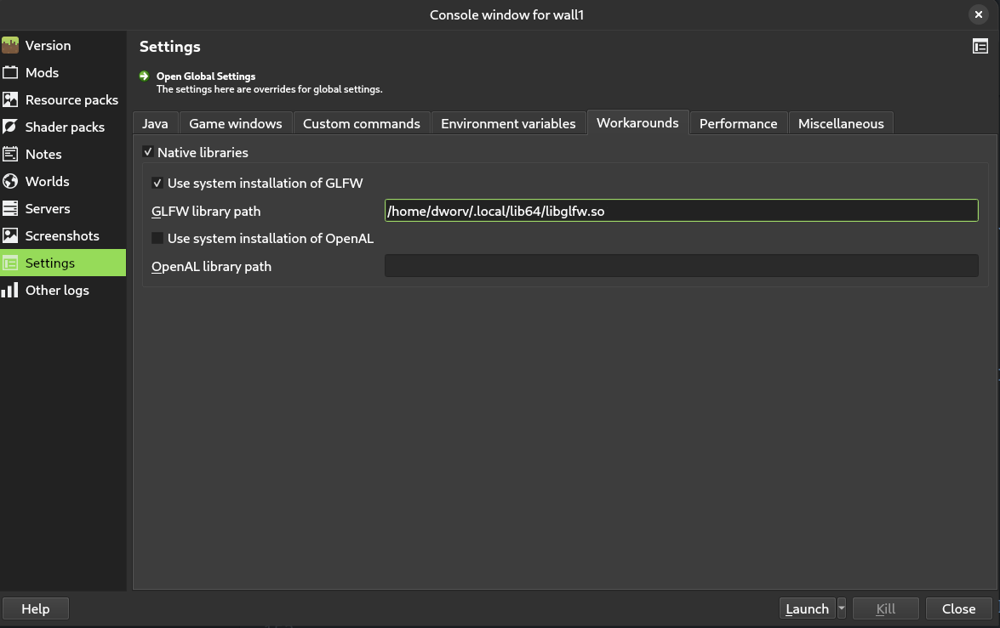
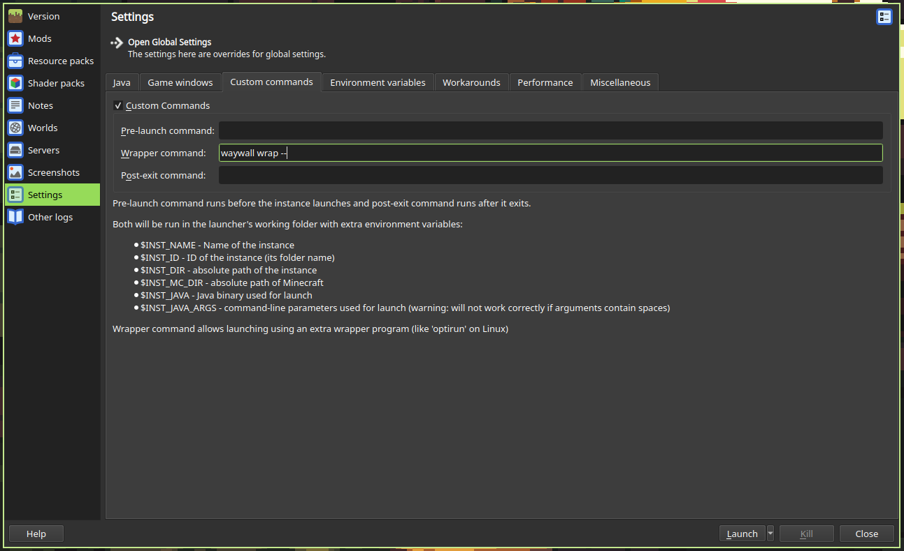

# Setting up waywall

> [!NOTE]
> waywall is still under development. Some features are missing or may not work
> as expected.

## Installing waywall

To compile waywall from source, first clone the repo.

```git clone https://github.com/tesselslate/waywall```

Then enter it.

```cd waywall```

Now that you have a local copy of waywall on your machine, compile it with `make`.

```make```

This command will create the `waywall` binary, located at `build/waywall/waywall`.

You can put this anywhere you wish to on your system, but we recommend putting it somewhere in your `PATH`, so you can call `waywall` from anywhere on your system. Placing it in either `~/.local/bin` or `/usr/bin` will usually work.

## Setting up config

In order for waywall to run, it needs instructions on how you need it to work. You can do this by creating an `init.lua` script at `~/.config/waywall/init.lua`. This is a basic configuration you could use:

```lua
local waywall = require("waywall")
local helpers = require("waywall.helpers")

local config = {
    input = {
        remaps = {
        },

        layout = "us",
        repeat_rate = 40,
        repeat_delay = 300,

        sensitivity = 1.0,
        confine_pointer = false,
    },
    theme = {
        background = "#303030ff",
    },
}

config.actions = {}

return config
```

For more information in configuring waywall, visit [the configuration guide](CONFIGURATION.md).

## Instance setup

Before you can use an instance of Minecraft with waywall, it will require some additional setup. This guide will assume that you are using [Prism Launcher](https://prismlauncher.org), a fork of [MultiMC](https://multimc.org/) with additional features and improvements.

### GLFW

The build of GLFW (a library Minecraft uses) that you usually use to play is outdated and doesn't work right with waywall. To get your instances up to a working version of GLFW with patches to make it work correctly, follow these steps:

Clone the GLFW repository.

```git clone https://github.com/glfw/glfw```

Then enter it.

```cd glfw```

Now, load the correct version.

```git checkout 3.4```

Now, move the patch file (can be found [here](assets/glfw.patch)).

```git apply glfw.patch```

Step 1 of building it:

```cmake -S . -B build -DBUILD_SHARED_LIBS=ON -DGLFW_BUILD_WAYLAND=ON```

Enter the build directory:

```cd build```

Step 2 of building it:

```make```

Finally, move your new compiled `glfw` (found at `glfw/build/src/libglfw.so`) to a safe place (like `~/.local/lib64`).

Now, you can use this modified and up-to-date `glfw`. Configure the path to your `glfw` build like so:



> [!IMPORTANT]
> If you are using an NVIDIA GPU, you need to set the environment variable `__GL_THREADED_OPTIMIZATIONS` to `0` or else Minecraft will crash when starting up. This can be done in the `Environment variables` tab in your instance's settings.

### Launching with waywall

By default, your Minecraft instances will launch under your normal compositor. In order for a Minecraft instance to run under waywall, you must change the command used to launch it.

To do this, you will need to go to this menu in your instance's settings:



Then, insert the following command into the `Wrapper command` box:

```sh
waywall wrap --
```

After this, your Minecraft instance should launch inside of waywall.
