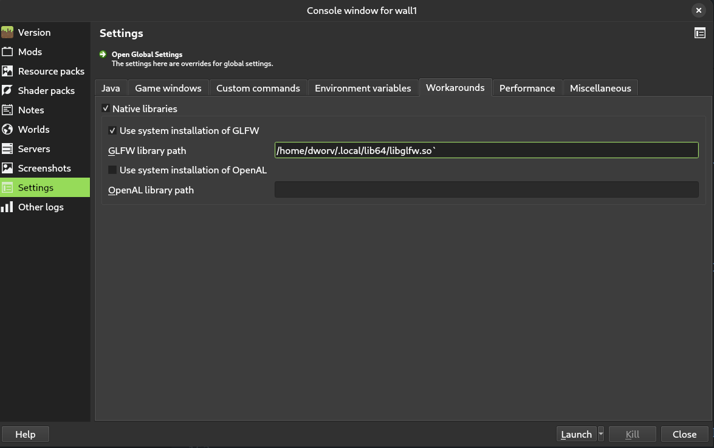

# Setting up waywall

> [!WARNING]
> waywall is still under active development. Many features are missing or may
> not work as expected.

## Installing waywall

### Option 1: Install premade package

TODO

### Option 2: Compile from source

To compile waywall from source, first clone the repo.

```git clone https://github.com/tesselslate/waywall```

Then enter it.

```cd waywall```

Now that you have a local copy of waywall on your machine, compile it with `make`.

```make```

This command will create the `waywall` binary, located at `build/waywall/waywall`.

You can put this anywhere you wish to on your system, but we recommend putting it somewhere in your `PATH`, so you can call `waywall` from anywhere on your system. Placing it in either `~/.local/bin` or `/usr/bin` will usually work.

## Setting up config

In order for waywall to run, it needs instructions on how you need it to work. You can do this by creating an `init.lua` script at `~/.config/waywall/init.lua`. This is a basic configuration you could use:

```lua
local waywall = require("waywall")
local helpers = require("waywall.helpers")

local config = {
    general = {
    },
    cpu = {
        weight_idle = 1,
        weight_low = 2,
        weight_high = 20,
        weight_active = 100,
        preview_threshold = 30,
    },
    input = {
        remaps = {
        },

        layout = "us",
        repeat_rate = 40,
        repeat_delay = 300,

        sensitivity = 1.0,
        confine_pointer = false,
    },
    theme = {
        background = "#303030ff",
    },
}

local wall = helpers.wall({
    width = 2,
    height = 3,
    stretch_width = 640,
    stretch_height = 216,

    grace_period = 150,
    bypass = true,
})

config.actions = {
    ["Ctrl-Shift-D"] = function()
        if waywall.active_instance() then
            wall.reset_ingame()
        else
            wall.reset_all()
        end
    end,
    ["LMB"] = wall.reset,
    ["Shift-LMB"] = wall.play,
    ["Ctrl-LMB"] = wall.toggle_lock,
    ["Ctrl-Shift-LMB"] = wall.focus_reset,
}

return config
```

For more information in configuring waywall, visit [the configuration guide](CONFIGURATION.md).

## Preparing CPUs

Waywall uses a Linux feature called `cgroups` to make sure your system is prioritizing your active Minecraft instance and deprioritizing your other ones to ensure the best possible performance. Right now, we need root access to create these `cgroups`. To prepare them, run this command:

```sudo waywall cpu```

This doesn't need to be run every time you want to run waywall, only once after each time you restart your computer.

If you've followed all of these steps correctly, running `waywall` should work properly! Try it, if it doesn't work you've done something wrong and aren't ready for the next step.

It should appear as a window with the coloured background you chose in your `init.lua` file with the `config.theme` setting.

## Preparing your instances.

There are a few things you need to change/check about each of your Minecraft instances for them to work properly.

### Mods

(This is not an exaustive list of mods recommended for speedrunning, just what you need to waywall to work properly)

- Atum 1.2.2 or higher
- State Output 1.1.6 or higher

### GLFW

The build of GLFW (a library Minecraft uses) that you usually use to play is outdated and doesn't work right with waywall. To get your instances up to a working version of GLFW with patches to make it work correctly, follow these steps:

Clone the GLFW repository.

```git clone https://github.com/glfw/glfw```

Then enter it.

```cd glfw```

Now, load the correct version.

```git checkout 3.4```

Now, move the patch file (can be found [here](assets/glfw.patch)).

```git apply glfw.patch```

Step 1 of building it:

```cmake -S . -B build -DBUILD_SHARED_LIBS=ON -DGLFW_BUILD_WAYLAND=ON```

Enter the build directory:

```cd build```

Step 2 of building it:

```make```

Finally, move your new compiled `glfw` (found at `glfw/build/src/libglfw.so`) to a safe place (like `~/.local/lib64`).

Now, you can use this modified and up-to-date `glfw`. Configure the path to your `glfw` build like so:



### Launch command

Waywall needs you to launch your instances in a very special way so that it can pick them up.

To edit the launch command of an instance (this tutorial uses Prism Launcher but this should be possible in other launchers too), go to this menu in your instance's settings:


and insert this command into the `Wrapper command` box.

```sh
sh -c "export LD_PRELOAD='/usr/lib/libjemalloc.so'; export MALLOC_CONF=background_thread:true,narenas:2,dirty_decay_ms:15000,muzzy_decay_ms:15000; waywall exec $INST_JAVA $@"
```

Now, when you launch this instance (it will only work while waywall is running), it will appear inside the waywall window!

# Running waywall after setup

Now that you've setup waywall, here's now to run it (this assumes you have restarted your computer since setting up waywall, but these instructions should work right away too).

Open a terminal and run these commands

```sh
sudo waywall cpu
waywall
```

Then, launch all of the instances you prepared. You should be good to go!
